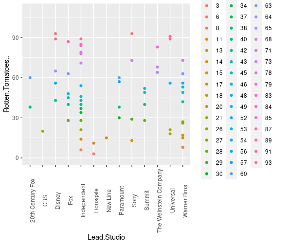
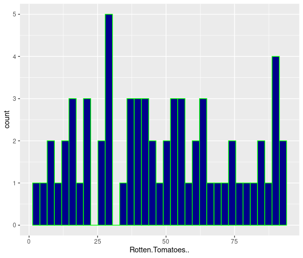
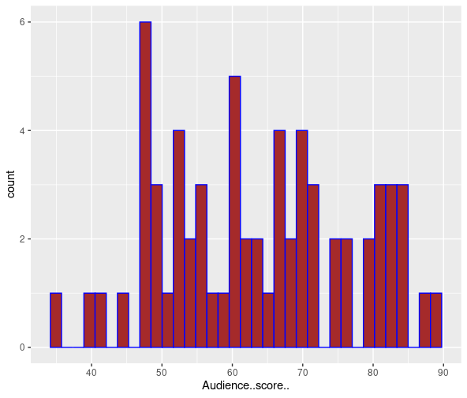
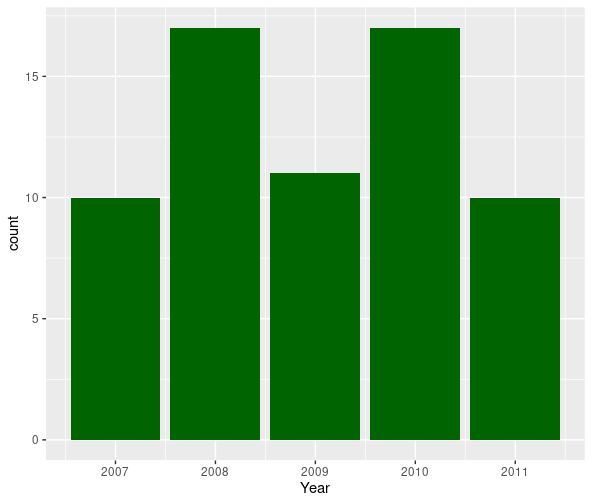
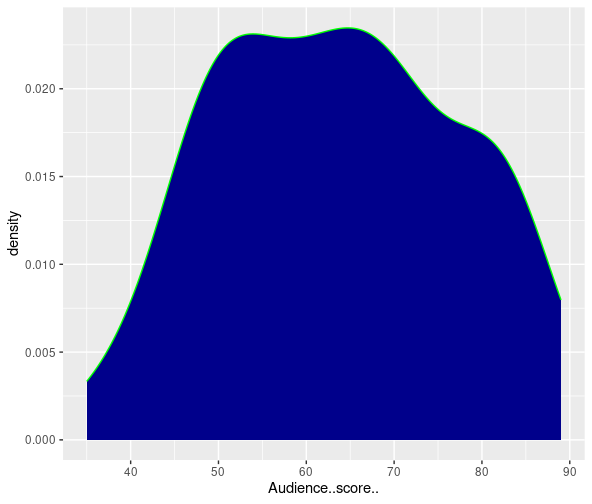
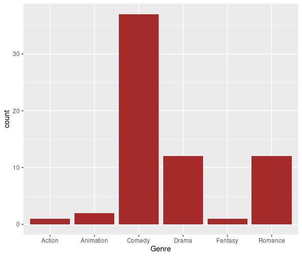
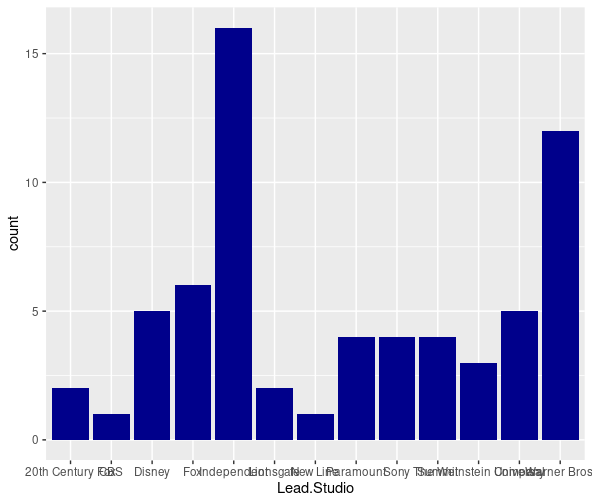

# Data Analysis Using R
## Project Name: Hollywoods Most Profitable Stories

### Scatter Plot to Compare Average Profitability Per Gengre

  

### Histogram Plot to Compare Average Profitability Per Gengre

  

  

  

  

  

  

